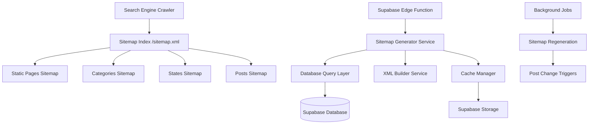

# Design Document

## Overview

The sitemap optimization system will generate comprehensive XML sitemaps for the Qbuyse marketplace, providing search engines with structured information about all pages, categories, and state-specific content. The system will be built as a server-side solution using Supabase Edge Functions to generate and serve sitemaps dynamically while maintaining performance through intelligent caching.

## Architecture

### High-Level Architecture



### System Components

1. **Sitemap Index Generator**: Main entry point that lists all sub-sitemaps
2. **Static Pages Generator**: Handles fixed pages (home, about, terms, etc.)
3. **Categories Generator**: Creates category and state-category combination URLs
4. **States Generator**: Generates state-specific pages
5. **Posts Generator**: Dynamic sitemap for all active posts
6. **Cache Manager**: Handles sitemap caching and invalidation
7. **Background Job Processor**: Handles automatic sitemap regeneration

## Components and Interfaces

### Core Interfaces

```typescript
interface SitemapEntry {
  url: string;
  lastmod: string;
  changefreq: 'always' | 'hourly' | 'daily' | 'weekly' | 'monthly' | 'yearly' | 'never';
  priority: number;
}

interface SitemapIndex {
  sitemaps: {
    loc: string;
    lastmod: string;
  }[];
}

interface SitemapConfig {
  baseUrl: string;
  maxUrlsPerSitemap: number;
  cacheExpiryMinutes: number;
}

interface StateInfo {
  name: string;
  code: string;
  slug: string;
}

interface CategoryInfo {
  id: string;
  name: string;
  slug: string;
}
```

### Service Layer

```typescript
class SitemapGeneratorService {
  constructor(private config: SitemapConfig) {}
  
  async generateSitemapIndex(): Promise<string>
  async generateStaticSitemap(): Promise<string>
  async generateCategoriesSitemap(): Promise<string>
  async generateStatesSitemap(): Promise<string>
  async generatePostsSitemap(page?: number): Promise<string>
  
  private buildXmlSitemap(entries: SitemapEntry[]): string
  private getLastModified(type: string): Promise<string>
}

class CacheManager {
  async get(key: string): Promise<string | null>
  async set(key: string, value: string, expiryMinutes: number): Promise<void>
  async invalidate(pattern: string): Promise<void>
  async exists(key: string): Promise<boolean>
}

class BackgroundJobProcessor {
  async schedulePostsSitemapRegeneration(): Promise<void>
  async processScheduledJobs(): Promise<void>
  private async regeneratePostsSitemap(): Promise<void>
}
```

## Data Models

### Indian States Configuration

```typescript
const INDIAN_STATES: StateInfo[] = [
  { name: "Andhra Pradesh", code: "AP", slug: "andhra-pradesh" },
  { name: "Arunachal Pradesh", code: "AR", slug: "arunachal-pradesh" },
  { name: "Assam", code: "AS", slug: "assam" },
  { name: "Bihar", code: "BR", slug: "bihar" },
  { name: "Chhattisgarh", code: "CG", slug: "chhattisgarh" },
  { name: "Goa", code: "GA", slug: "goa" },
  { name: "Gujarat", code: "GJ", slug: "gujarat" },
  { name: "Haryana", code: "HR", slug: "haryana" },
  { name: "Himachal Pradesh", code: "HP", slug: "himachal-pradesh" },
  { name: "Jharkhand", code: "JH", slug: "jharkhand" },
  { name: "Karnataka", code: "KA", slug: "karnataka" },
  { name: "Kerala", code: "KL", slug: "kerala" },
  { name: "Madhya Pradesh", code: "MP", slug: "madhya-pradesh" },
  { name: "Maharashtra", code: "MH", slug: "maharashtra" },
  { name: "Manipur", code: "MN", slug: "manipur" },
  { name: "Meghalaya", code: "ML", slug: "meghalaya" },
  { name: "Mizoram", code: "MZ", slug: "mizoram" },
  { name: "Nagaland", code: "NL", slug: "nagaland" },
  { name: "Odisha", code: "OD", slug: "odisha" },
  { name: "Punjab", code: "PB", slug: "punjab" },
  { name: "Rajasthan", code: "RJ", slug: "rajasthan" },
  { name: "Sikkim", code: "SK", slug: "sikkim" },
  { name: "Tamil Nadu", code: "TN", slug: "tamil-nadu" },
  { name: "Telangana", code: "TG", slug: "telangana" },
  { name: "Tripura", code: "TR", slug: "tripura" },
  { name: "Uttar Pradesh", code: "UP", slug: "uttar-pradesh" },
  { name: "Uttarakhand", code: "UK", slug: "uttarakhand" },
  { name: "West Bengal", code: "WB", slug: "west-bengal" },
  { name: "Delhi", code: "DL", slug: "delhi" }
];
```

### Categories Configuration

```typescript
const CATEGORIES: CategoryInfo[] = [
  { id: "Cars", name: "Cars", slug: "cars" },
  { id: "Properties", name: "Properties", slug: "properties" },
  { id: "Mobiles", name: "Mobiles", slug: "mobiles" },
  { id: "Jobs", name: "Jobs", slug: "jobs" },
  { id: "Fashion", name: "Fashion", slug: "fashion" },
  { id: "Bikes", name: "Bikes", slug: "bikes" },
  { id: "Electronics", name: "Electronics & Appliances", slug: "electronics" },
  { id: "Commercial", name: "Commercial Vehicles", slug: "commercial-vehicles" },
  { id: "Furniture", name: "Furniture", slug: "furniture" },
  { id: "Pets", name: "Pets", slug: "pets" },
  { id: "Kids", name: "Kids", slug: "kids" },
  { id: "Sports", name: "Sports & Fitness", slug: "sports-fitness" },
  { id: "Books", name: "Books", slug: "books" },
  { id: "Services", name: "Services", slug: "services" },
  { id: "Gaming", name: "Gaming", slug: "gaming" },
  { id: "Photography", name: "Photography", slug: "photography" }
];
```

### Static Pages Configuration

```typescript
const STATIC_PAGES = [
  { url: '/', priority: 1.0, changefreq: 'daily' },
  { url: '/search', priority: 0.8, changefreq: 'daily' },
  { url: '/post', priority: 0.7, changefreq: 'weekly' },
  { url: '/about', priority: 0.5, changefreq: 'monthly' },
  { url: '/terms', priority: 0.3, changefreq: 'yearly' },
  { url: '/privacy', priority: 0.3, changefreq: 'yearly' }
];
```

## Error Handling

### Error Types and Responses

```typescript
enum SitemapErrorType {
  GENERATION_FAILED = 'GENERATION_FAILED',
  CACHE_ERROR = 'CACHE_ERROR',
  DATABASE_ERROR = 'DATABASE_ERROR',
  INVALID_REQUEST = 'INVALID_REQUEST'
}

class SitemapError extends Error {
  constructor(
    public type: SitemapErrorType,
    message: string,
    public statusCode: number = 500
  ) {
    super(message);
  }
}

// Error handling middleware
const handleSitemapError = (error: SitemapError) => {
  console.error(`Sitemap Error [${error.type}]:`, error.message);
  
  switch (error.type) {
    case SitemapErrorType.INVALID_REQUEST:
      return new Response('Invalid sitemap request', { status: 404 });
    case SitemapErrorType.DATABASE_ERROR:
      return new Response('Database temporarily unavailable', { status: 503 });
    default:
      return new Response('Sitemap temporarily unavailable', { status: 500 });
  }
};
```

### Fallback Strategies

1. **Cache Fallback**: Serve stale cache if generation fails
2. **Partial Generation**: Generate available sitemaps even if some fail
3. **Retry Logic**: Automatic retry with exponential backoff
4. **Graceful Degradation**: Serve basic sitemap if full generation fails

## Testing Strategy

### Unit Tests

```typescript
describe('SitemapGeneratorService', () => {
  test('should generate valid XML sitemap index')
  test('should handle empty post results gracefully')
  test('should respect URL limits per sitemap')
  test('should generate proper lastmod dates')
  test('should create valid state-category combinations')
});

describe('CacheManager', () => {
  test('should cache and retrieve sitemaps correctly')
  test('should handle cache expiry properly')
  test('should invalidate cache patterns correctly')
});

describe('BackgroundJobProcessor', () => {
  test('should schedule regeneration jobs correctly')
  test('should process jobs in correct order')
  test('should handle job failures gracefully')
});
```

### Integration Tests

```typescript
describe('Sitemap API Integration', () => {
  test('should serve sitemap index at /sitemap.xml')
  test('should serve category sitemaps with correct URLs')
  test('should serve state sitemaps with all states')
  test('should serve posts sitemaps with active posts only')
  test('should update sitemaps when posts are created/deleted')
});

describe('Performance Tests', () => {
  test('should generate sitemaps within 30 seconds')
  test('should handle 100,000+ URLs efficiently')
  test('should serve cached sitemaps quickly')
});
```

### SEO Validation Tests

```typescript
describe('SEO Compliance', () => {
  test('should generate valid XML according to sitemap protocol')
  test('should include proper HTTP headers')
  test('should compress responses with gzip')
  test('should include sitemap reference in robots.txt')
  test('should use canonical URLs consistently')
});
```

## Performance Considerations

### Caching Strategy

1. **Multi-Level Caching**:
   - L1: In-memory cache for frequently accessed sitemaps
   - L2: Supabase Storage for persistent cache
   - L3: CDN caching for global distribution

2. **Cache Invalidation**:
   - Time-based expiry (configurable per sitemap type)
   - Event-based invalidation (post creation/deletion)
   - Manual invalidation for emergency updates

3. **Background Generation**:
   - Pre-generate sitemaps during low-traffic periods
   - Incremental updates for posts sitemap
   - Parallel generation for independent sitemaps

### Database Optimization

```sql
-- Indexes for efficient sitemap queries
CREATE INDEX idx_posts_sitemap ON posts(created_at DESC, id) WHERE deleted_at IS NULL;
CREATE INDEX idx_posts_state_category ON posts(state, category, created_at DESC);

-- Materialized view for sitemap metadata
CREATE MATERIALIZED VIEW sitemap_metadata AS
SELECT 
  'posts' as sitemap_type,
  MAX(updated_at) as last_modified,
  COUNT(*) as url_count
FROM posts 
WHERE deleted_at IS NULL;
```

### Scalability Measures

1. **Horizontal Scaling**: Edge functions auto-scale based on demand
2. **Pagination**: Split large sitemaps into manageable chunks
3. **Lazy Loading**: Generate sitemaps on-demand when possible
4. **Resource Limits**: Implement timeouts and memory limits

## Security Considerations

### Access Control

1. **Public Access**: Sitemaps are publicly accessible (required for SEO)
2. **Rate Limiting**: Prevent abuse with request rate limits
3. **Input Validation**: Validate all parameters to prevent injection
4. **Error Information**: Limit error details in public responses

### Data Privacy

1. **Public Data Only**: Include only publicly accessible content
2. **User Privacy**: Exclude private or sensitive user information
3. **Content Filtering**: Exclude flagged or inappropriate content
4. **GDPR Compliance**: Respect user data deletion requests

## Deployment Strategy

### Edge Function Deployment

```typescript
// supabase/functions/sitemap/index.ts
import { serve } from "https://deno.land/std@0.168.0/http/server.ts";
import { SitemapGeneratorService } from "./services/SitemapGenerator.ts";

serve(async (req) => {
  const url = new URL(req.url);
  const pathname = url.pathname;
  
  try {
    const generator = new SitemapGeneratorService({
      baseUrl: Deno.env.get('SITE_BASE_URL') || 'https://qbuyse.com',
      maxUrlsPerSitemap: 50000,
      cacheExpiryMinutes: 60
    });
    
    switch (pathname) {
      case '/sitemap.xml':
        return await generator.generateSitemapIndex();
      case '/sitemap-static.xml':
        return await generator.generateStaticSitemap();
      case '/sitemap-categories.xml':
        return await generator.generateCategoriesSitemap();
      case '/sitemap-states.xml':
        return await generator.generateStatesSitemap();
      default:
        if (pathname.startsWith('/sitemap-posts-')) {
          const page = parseInt(pathname.split('-').pop()?.replace('.xml', '') || '1');
          return await generator.generatePostsSitemap(page);
        }
        return new Response('Sitemap not found', { status: 404 });
    }
  } catch (error) {
    return handleSitemapError(error);
  }
});
```

### Environment Configuration

```bash
# Environment variables for sitemap generation
SITE_BASE_URL=https://qbuyse.com
SITEMAP_CACHE_EXPIRY_MINUTES=60
SITEMAP_MAX_URLS_PER_FILE=50000
SITEMAP_BACKGROUND_JOB_INTERVAL=3600
```

### Monitoring and Logging

1. **Performance Metrics**: Track generation time and cache hit rates
2. **Error Logging**: Log all errors with context for debugging
3. **Usage Analytics**: Monitor sitemap access patterns
4. **Health Checks**: Regular validation of sitemap availability

This design provides a comprehensive, scalable, and SEO-optimized sitemap system that will significantly improve the discoverability of the Qbuyse marketplace across all Indian states and categories.